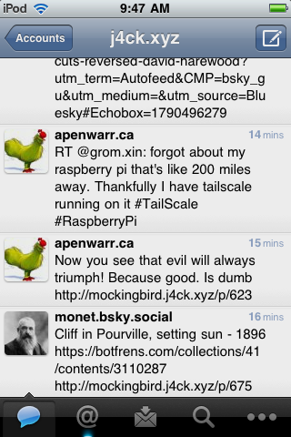
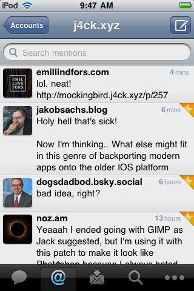
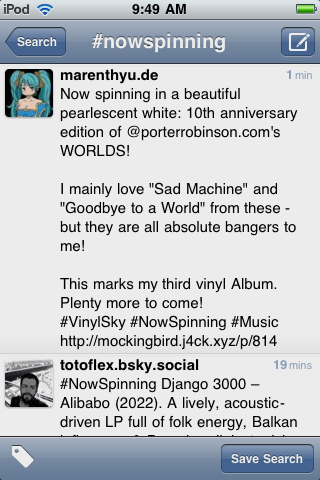
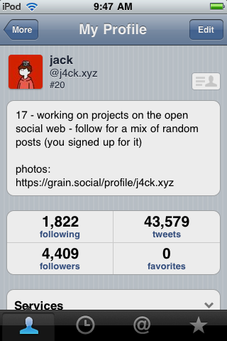
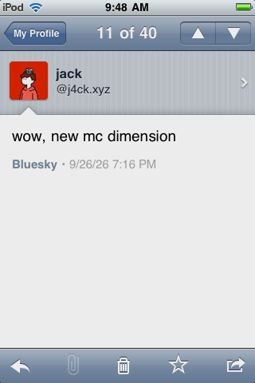
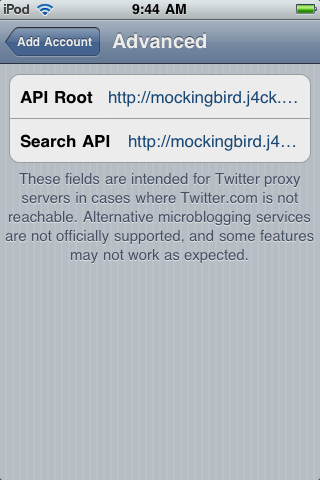
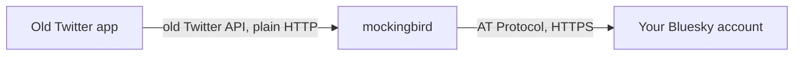

# mockingbird

**Use your old iPhone Twitter apps with Bluesky.**

mockingbird is a small bridge that lets Twitter apps from 2009 and 2010, such as Tweetie 2 and Twitterrific, read and post to Bluesky. The app thinks it is talking to the old Twitter; mockingbird quietly translates everything to and from your Bluesky account.

Try the hosted bridge at **http://mockingbird.j4ck.xyz**, or run your own in a few minutes.

<p align="center">
  
  
  
  
  
</p>
<p align="center"><sub>Tweetie 2 on iPhone OS 3, running on Bluesky: home timeline, mentions, search, profile and a single post.</sub></p>

## What works

Your home timeline, mentions and profiles; posting, replying and deleting; reposts (as retweets) and likes (as favourites); following and blocking; search and trends; direct messages; and photo uploads. Images and quote posts appear as links to simple pages that old in-app browsers can open.

Not supported: lists, locations and streaming. Videos appear as a link.

---

## Use the hosted bridge

**1. Make an app password.** On a phone or computer, open [bsky.app](https://bsky.app) › **Settings › Privacy and security › App passwords** and add one. Tick **Allow access to your direct messages** if you want DMs. Copy the password (it looks like `abcd-efgh-ijkl-mnop`).

**2. Point your app at mockingbird.** In the app's server or "advanced" settings:

| Setting | Type this |
|---|---|
| API root | `http://mockingbird.j4ck.xyz` |
| Search API | `http://mockingbird.j4ck.xyz` |
| Image service (if offered) | `http://mockingbird.j4ck.xyz/api/upload` |

In Tweetie 2, the settings are under **Add Account › Advanced**:

<p align="center">
  
</p>

**3. Sign in** with your Bluesky handle (for example `alice.bsky.social`, or just `alice` for `.bsky.social` accounts) and the app password.

Use `http://`, not `https://`: old apps cannot use modern secure connections.

**If it doesn't work**

| You see | Fix |
|---|---|
| "Could not authenticate you" | Check your handle, and that you used an app password. |
| "Use a Bluesky app password" | You typed your main password; make an app password instead. |
| "Too many failed logins" | Wait a few minutes and try again. |
| No direct messages | Make a new app password with DM access ticked. |

---

## Is it safe?

Yes, as long as you use an app password, and mockingbird refuses anything else.

- **Old apps can't encrypt their connection**, so someone on the same Wi-Fi could in theory see your login. An app password limits the damage: it can't change your account, and you can delete it at any time.
- **Your password is never stored.** mockingbird signs in once and keeps only an encrypted sign-in token.
- **Your posts stay on Bluesky.** mockingbird stores only a list of post numbers, your encrypted token, saved searches and a cache of resized profile pictures.
- **To stop, delete the app password** in Bluesky's settings. Access ends immediately.

Using the hosted bridge means trusting whoever runs it. If you'd rather not, run your own. Full details are in [docs/security.md](docs/security.md).

---

## How it works



Your app asks for something the old Twitter way, for example "my home timeline as XML". mockingbird fetches the same thing from Bluesky, then converts it into exactly the shape the old app expects: field names, date formats, small numeric IDs and all. The formats were checked against real Twitter responses from 2010, recovered from the Internet Archive.

It is **light**: one program, a 33 MB Docker image, around 55 MB of memory for 3,000 users, under 5 ms of added delay per request, and about 1 KB of data per timeline refresh. A Raspberry Pi is plenty.

---

## Run your own

You need a Linux machine that stays on (a Raspberry Pi 4 or 5 is ideal) with [Docker](https://docs.docker.com/engine/install/) installed.

### Option A: on the internet, with a Cloudflare Tunnel (recommended)

This is exactly how the hosted bridge runs. No router ports are opened, and the bridge is sandboxed so it can reach the internet but nothing else on your network.

1. [Create a Cloudflare Tunnel](https://developers.cloudflare.com/cloudflare-one/connections/connect-networks/get-started/create-remote-tunnel/) for your machine, or reuse one you already have.
2. On the machine, run:
   ```sh
   git clone https://github.com/j4ckxyz/mockingbird.git
   cd mockingbird
   ./deploy/pi/setup.sh mockingbird.example.com
   ```
   Replace `mockingbird.example.com` with your own hostname. The script installs the sandbox firewall, creates random keys, and builds and starts mockingbird. It asks for your password once, for `sudo`.
3. In the Cloudflare dashboard, open **Networks › Tunnels ›** your tunnel **› Published application routes › Add**. Enter your hostname, service **HTTP**, URL **`localhost:18480`**.
4. Make sure **Always Use HTTPS** is off for that hostname, and that no bot challenge applies to it.

Visit `http://your-hostname/` and you should see the landing page.

**To update later:** `git pull && ./deploy/pi/setup.sh mockingbird.example.com`. Your keys and data are kept.

### Option B: on your home network only (for Tweetie 2 and Twitterrific 1.x)

Some apps, including Tweetie 2 in its default set-up and Twitterrific 1.x, always talk to `twitter.com` and have no server setting. For those, run mockingbird on your home network and make `twitter.com` point at it.

1. Start it:
   ```sh
   git clone https://github.com/j4ckxyz/mockingbird.git
   cd mockingbird
   cp .env.example .env
   docker compose run --rm mockingbird genkeys >> .env
   ```
   In `.env`, delete the two empty key lines, and set `MB_PUBLIC_URL` to `http://` plus the machine's address, for example `http://192.168.1.50`. Then:
   ```sh
   echo 'net.ipv4.ip_unprivileged_port_start=80' | sudo tee /etc/sysctl.d/99-mockingbird.conf
   sudo sysctl --system
   docker compose up -d
   ```
2. Point the Twitter names at that address, only for your old devices:
   - **Pi-hole:** under **Local DNS › DNS Records**, add `twitter.com`, `api.twitter.com` and `search.twitter.com` pointing to the machine's IP.
   - **iPhone Simulator:** add `192.168.1.50 twitter.com api.twitter.com search.twitter.com` to `/etc/hosts` on the Mac.

   Then set the old iPhone's DNS server to your Pi-hole under **Settings › Wi-Fi**.

A few apps insist on HTTPS. mockingbird can serve an old-style HTTPS connection for them: see "Apps that insist on HTTPS" in [docs/configuration.md](docs/configuration.md#apps-that-insist-on-https).

---

## Handy commands

Run these on the machine hosting mockingbird. For Option A, run them from `deploy/pi/`.

| Task | Command |
|---|---|
| See logs | `docker compose logs -f` |
| Check it's alive | `curl http://127.0.0.1:18480/help/test.json` (Option A) or `curl http://localhost/help/test.json` (Option B) |
| See features apps asked for that aren't supported | `curl http://127.0.0.1:18490/admin/unknown` (Option A) or `curl http://127.0.0.1:9090/admin/unknown` (Option B) |
| Log every request | set `MB_LOG_LEVEL=debug` in `.env`, then `docker compose up -d` |
| Stop | `docker compose down` |

Everything mockingbird keeps is in one Docker volume, so back that up if you like. The image cache inside it can be deleted at any time.

---

## More

- [docs/configuration.md](docs/configuration.md): every setting
- [docs/security.md](docs/security.md): exactly how accounts and your network are protected
- [docs/development.md](docs/development.md): tests, the load tester and the code layout
- [NOTES.md](NOTES.md): quirks of the old Twitter API and its apps

mockingbird is not affiliated with Twitter, X Corp or Bluesky Social PBC.
