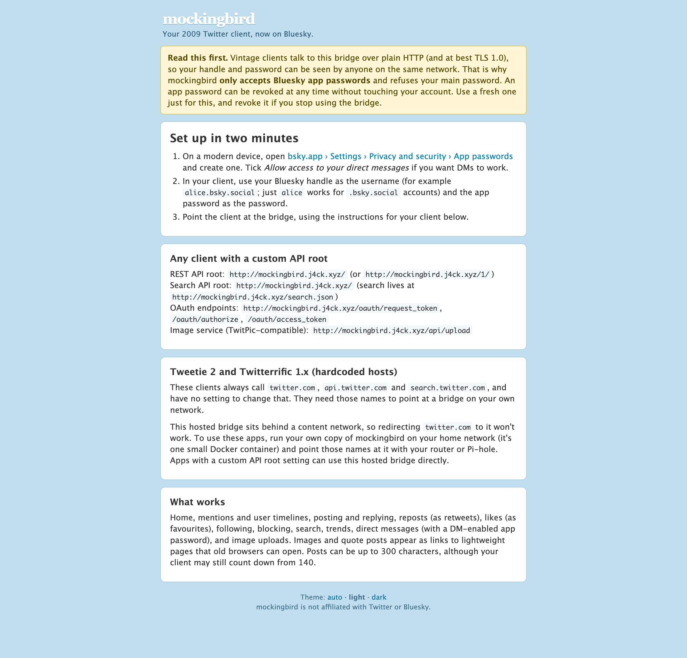
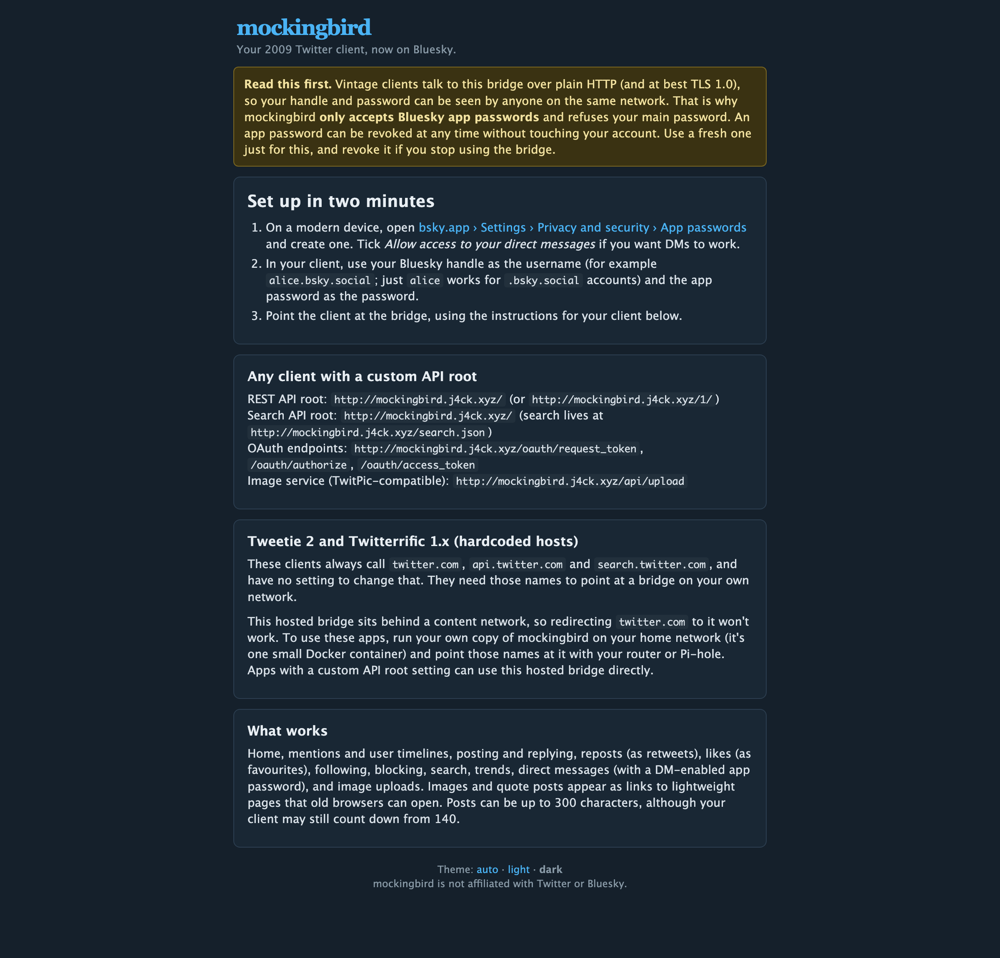
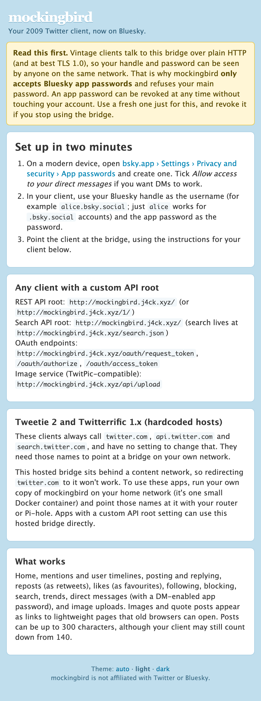
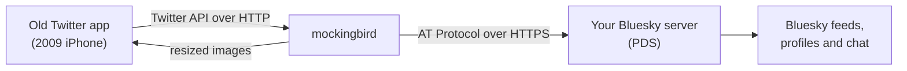

# mockingbird

**Use your old iPhone Twitter apps with Bluesky.**

mockingbird is a small bridge that lets Twitter apps from 2009 and 2010, such as Tweetie 2 and Twitterrific, read and post to Bluesky. The app thinks it is talking to the old Twitter. Behind the scenes, mockingbird translates every request into Bluesky's own language and sends it to your Bluesky account.

There is a hosted copy you can try right now at **http://mockingbird.j4ck.xyz**, or you can run your own on anything from a Raspberry Pi upwards.

<p align="center">
  
</p>

<p align="center">
  
  
</p>

---

## Contents

1. [What you can do with it](#what-you-can-do-with-it)
2. [Use the hosted bridge](#use-the-hosted-bridge)
3. [Is it safe?](#is-it-safe)
4. [How it works](#how-it-works)
5. [How lightweight it is](#how-lightweight-it-is)
6. [Run your own](#run-your-own)
7. [How-to guides](#how-to-guides)
8. [What works and what doesn't](#what-works-and-what-doesnt)
9. [Settings reference](#settings-reference)
10. [Security in detail](#security-in-detail)
11. [For developers](#for-developers)

---

## What you can do with it

With a vintage Twitter app pointed at mockingbird, you can:

- read your Bluesky home timeline, mentions and other people's profiles;
- post, reply, delete, repost (shown as a retweet) and like (shown as a favourite);
- follow, unfollow and block people;
- search Bluesky and see what's trending;
- send and read direct messages;
- attach photos, if your app supports a custom image service.

Images and quote posts show up as links to simple pages that open in the app's built-in browser, even on an iPhone from 2009.

---

## Use the hosted bridge

You need two things: an **app password** from Bluesky, and a Twitter app that lets you change its server address (often labelled "API root", "API URL" or "custom server").

### Step 1: create an app password

An app password is a separate, throwaway password for one app. It can't change your account settings, and you can cancel it at any time without affecting your real password.

1. On a phone or computer, open [bsky.app](https://bsky.app) and sign in.
2. Go to **Settings › Privacy and security › App passwords**.
3. Choose **Add App Password** and give it a name such as `mockingbird`.
4. If you want direct messages to work, tick **Allow access to your direct messages**.
5. Copy the password it shows you. It looks like `abcd-efgh-ijkl-mnop`. You will only see it once.

> mockingbird will refuse your normal Bluesky password. That is deliberate, and it protects you. See [Is it safe?](#is-it-safe)

### Step 2: point your app at mockingbird

In your app's account or server settings, enter:

| Setting | What to type |
|---|---|
| API root / server | `http://mockingbird.j4ck.xyz/` |
| Search API (if asked) | `http://mockingbird.j4ck.xyz/` |
| Username | your Bluesky handle, for example `alice.bsky.social` |
| Password | the app password from step 1 |

A few tips:

- If your handle ends in `.bsky.social`, you can type just the first part, so `alice` works for `alice.bsky.social`.
- Use `http://`, not `https://`. Old apps cannot use modern secure connections. This is why mockingbird only accepts app passwords.
- If your app has a setting for an image or photo service, set it to `http://mockingbird.j4ck.xyz/api/upload`.
- Apps that sign in through a web page (OAuth) will open a simple mockingbird sign-in form. Enter your handle and app password there.

### Apps with a fixed Twitter address

Tweetie 2 and Twitterrific 1.x have no server setting. They always talk to `twitter.com` directly. To use them, you need a copy of mockingbird on your own home network, plus a small change to your network so that `twitter.com` points at it. The hosted bridge cannot do this, because it sits behind Cloudflare. See [Use Tweetie 2 or Twitterrific 1.x](#use-tweetie-2-or-twitterrific-1x).

### If something goes wrong

| What you see | What to do |
|---|---|
| "Could not authenticate you" | Check the handle and the app password. Make sure the password is an app password, not your main one. |
| "Use a Bluesky app password, not your account password" | You typed your normal password. Create an app password (step 1). |
| "Too many failed logins" | Wait a few minutes, then try again with the correct details. |
| Direct messages are empty, or sending fails | Create a new app password with **Allow access to your direct messages** ticked. |
| The app says the post is too long | Old apps count to 140. Bluesky allows 300, but the app may block you before mockingbird sees the post. |

---

## Is it safe?

The short version: **yes, provided you use an app password**, which mockingbird insists on.

- **The connection isn't encrypted.** Apps from 2009 can't use modern security, so your username and password travel over plain HTTP. Someone on the same Wi-Fi could, in principle, read them. That is why mockingbird only accepts app passwords: even if one leaked, it can't change your account, and you can cancel it in seconds from Bluesky's settings.
- **Your password is never stored.** mockingbird uses it once to sign in to Bluesky and then keeps only an encrypted sign-in token. The password is never written to disk or to logs.
- **Your data stays on Bluesky.** mockingbird does not keep copies of your posts or messages. It stores a list of number-to-post mappings (old apps need numbers, Bluesky uses long addresses), your encrypted sign-in tokens, any saved searches, and a cache of resized profile pictures.
- **You can stop at any time.** Delete the app password in Bluesky's settings and mockingbird loses access immediately.

When you use the hosted bridge, you are trusting whoever runs it, just as with any third-party app. If that worries you, [run your own](#run-your-own). It takes about ten minutes.

---

## How it works



In plain words:

1. Your app asks for something in the old Twitter way, for example "give me my home timeline as XML".
2. mockingbird works out who you are, looks up your Bluesky account, and asks your Bluesky server for the same thing using Bluesky's protocol (the AT Protocol).
3. It converts the answer back into exactly the format the old app expects, down to the date format, field names and the order of fields, then sends it back compressed.

Some of the details it takes care of:

- **Numbers for posts.** Old apps expect every post and person to have a number. mockingbird hands out small, stable numbers, kept under the limit that broke some apps in 2009.
- **Paging.** When the app asks for "posts since number 1234", mockingbird works out what time that post was from and fetches everything newer.
- **Links and pictures.** Bluesky shortens long links in posts; mockingbird puts the full link back. Images become a link to a simple page that old browsers can open. Retweets appear both as proper retweets and as the classic "RT @someone:" text, for apps that predate retweets.
- **Profile pictures.** These are fetched from Bluesky, resized to the exact sizes old Twitter used (24, 48 and 73 pixels), and cached.
- **Writing posts.** When you post, mockingbird turns @mentions, links and #hashtags into proper Bluesky links, and threads replies correctly.

The formats were checked against real Twitter API responses from 2010, recovered from the Internet Archive.

---

## How lightweight it is

mockingbird is one small program with no other services to run: no database server and no cache server.

| | |
|---|---|
| Docker image | about 33 MB |
| Memory with 3,000 users | about 55 MB |
| Extra delay it adds to each request | under 5 ms (95% of requests), measured with 3,000 users on one CPU core |
| Data sent per timeline refresh | about 1 KB, compressed |
| Runs on | a Raspberry Pi 5, or any 64-bit ARM or Intel machine with Docker |

It was designed for a home internet connection: responses are compressed, images are shrunk to what an original iPhone can show, and repeated requests are cached and combined.

---

## Run your own

Running your own copy means you don't have to trust anyone else, and it is the only way to use apps with a fixed Twitter address.

### What you need

- A computer that stays on, such as a Raspberry Pi 4 or 5, a home server or a small cloud machine.
- [Docker](https://docs.docker.com/engine/install/) with the Compose plugin.
- Optionally, a domain name if you want to reach it from outside your home.

### Quick start

```sh
git clone https://github.com/j4ckxyz/mockingbird.git
cd mockingbird
cp .env.example .env
docker compose build
docker compose run --rm mockingbird genkeys >> .env
```

Open `.env` in a text editor:

- delete the two empty `MB_SECRET_KEY=` and `MB_ENCRYPTION_KEY=` lines (keep the filled-in ones that were added at the end);
- set `MB_PUBLIC_URL` to the address people will use, for example `http://192.168.1.50` or `http://bird.example.com`.

Then start it:

```sh
docker compose up -d
curl http://localhost/help/test.json     # should print "ok"
```

Open `http://<your address>/` in a browser to see your own landing page.

The default `compose.yaml` listens on port 80. On Linux, allow an ordinary user to use port 80 once:

```sh
echo 'net.ipv4.ip_unprivileged_port_start=80' | sudo tee /etc/sysctl.d/99-mockingbird.conf
sudo sysctl --system
```

Or set `MB_HTTP_ADDR=:8080` in `.env` and use port 8080 instead.

### Publishing it with a Cloudflare Tunnel (recommended)

A Cloudflare Tunnel puts your bridge on the internet without opening any ports on your router. This is how the hosted bridge runs. The files are in [`deploy/pi/`](deploy/pi/).

1. **Install the firewall.** It keeps the bridge boxed off from the rest of your network: it can reach the internet but nothing on your LAN, your other containers, Tailscale or the host itself.
   ```sh
   sudo install -d /etc/mockingbird
   sudo install -m 0644 deploy/pi/firewall.nft /etc/mockingbird/
   sudo install -m 0644 deploy/pi/mockingbird-firewall.service /etc/systemd/system/
   sudo systemctl daemon-reload
   sudo systemctl enable --now mockingbird-firewall
   ```
2. **Configure and start the bridge.**
   ```sh
   cd deploy/pi
   cp env.example .env
   echo "MB_SECRET_KEY=$(openssl rand -hex 32)" >> .env
   echo "MB_ENCRYPTION_KEY=$(openssl rand -hex 32)" >> .env
   ```
   Remove the empty key lines at the top of `.env`, set `MB_PUBLIC_URL` and `MB_BRIDGE_HOSTS` to your hostname, then:
   ```sh
   chmod 600 .env
   docker compose up -d --build
   ```
   The bridge now listens on `127.0.0.1:18480`. That address is only reachable from the machine itself.
3. **Add a route in Cloudflare.** In the Cloudflare dashboard go to **Networks › Tunnels**, choose your tunnel (or create one and install `cloudflared`), then **Published application routes › Add**. Use your hostname, service type **HTTP** and URL **`localhost:18480`**.
4. **Allow plain HTTP.** Old apps can't use HTTPS, so make sure **Always Use HTTPS** is off for this hostname, and that no bot challenge applies to it (apps cannot solve challenges).

Adding a route to an existing tunnel doesn't affect its other routes, and nothing needs restarting.

### Use Tweetie 2 or Twitterrific 1.x

These apps always contact `twitter.com`, `api.twitter.com` and `search.twitter.com`. You make those names point at your own bridge on your home network.

1. Run mockingbird on your network, listening on port 80 (see [Quick start](#quick-start)), and note its IP address, for example `192.168.1.50`.
2. Make the Twitter names resolve to that address, using whichever of these suits you:
   - **iPhone Simulator on a Mac:** add this line to `/etc/hosts` on the Mac:
     ```
     192.168.1.50  twitter.com www.twitter.com api.twitter.com search.twitter.com
     ```
   - **Pi-hole:** under **Local DNS › DNS Records**, add each of the four names with your bridge's IP.
   - **dnsmasq or a router with custom DNS:**
     ```
     address=/twitter.com/192.168.1.50
     address=/search.twitter.com/192.168.1.50
     ```
     Then set your old iPhone's DNS server to that machine under **Settings › Wi-Fi › (your network)**.
3. Open the app and sign in with your Bluesky handle and an app password.

> Only point your old devices (or a separate DNS profile) at this. If you change it for your whole network, every device's twitter.com will stop working.

### Apps that insist on HTTPS

A few apps only use `https://`. mockingbird can run an extra, deliberately old-fashioned HTTPS listener (TLS 1.0) that 2009 iPhones understand, using its own certificate authority.

1. Set `MB_LEGACY_TLS_ADDR=:443` in `.env` and restart.
2. On the old iPhone, open `http://<your bridge>/` in Safari, tap **Install profile**, and follow the prompts.

> **Think before installing this.** The device will trust certificates made by your bridge. The certificate authority is limited to the bridge's own names and the Twitter names, but very old iPhones may not enforce that limit. Anyone who stole the key from your bridge's data folder could pretend to be those sites to that device. Only install it on a device you use for vintage apps, and remove it afterwards under **Settings › General › Profiles**.

---

## How-to guides

### Cancel access
In Bluesky, go to **Settings › Privacy and security › App passwords** and delete the password. mockingbird loses access immediately. The next time the app tries, it will be asked to sign in again.

### Get direct messages working
App passwords don't include messages unless you ask. Create a new app password with **Allow access to your direct messages** ticked, and sign in again with it. Group chats are skipped, because old Twitter had no equivalent.

### Post photos
Set the app's image or photo service to `http://<bridge>/api/upload` (it mimics TwitPic). When you post, mockingbird swaps the photo link for a real Bluesky image.

### See what your app is asking for
Handy when an app does something mockingbird doesn't support yet:

```sh
curl http://127.0.0.1:9090/admin/unknown      # on the machine running mockingbird
```

This lists every unsupported feature an app has tried, with how often. Set `MB_LOG_LEVEL=debug` to log every request as well; logs include parameter names only, never passwords or tokens.

### Watch it with Prometheus or Grafana
Metrics are at `http://127.0.0.1:9090/metrics` (or port 18490 in the Cloudflare set-up). They are only ever served on the machine itself or over Tailscale, never publicly. Useful ones:
- `mockingbird_translation_seconds`: time spent inside mockingbird
- `mockingbird_upstream_seconds`: time waiting on Bluesky
- `mockingbird_logins_total`: sign-ins, by outcome

### Update to a new version
```sh
git pull
docker compose up -d --build
```

### Back up
Everything lives in the Docker volume mounted at `/data`: the database, the certificate files (if you use HTTPS) and the image cache. The image cache can be deleted at any time; it refills itself.

### Change the secret keys
Changing `MB_ENCRYPTION_KEY` signs everyone out. Apps using a username and password sign back in automatically; apps that used a sign-in page need to sign in again. Changing `MB_SECRET_KEY` also changes image links and sign-in tokens.

---

## What works and what doesn't

| Twitter feature | Works? | Notes |
|---|---|---|
| Home timeline, mentions, user timelines | Yes | JSON, XML, RSS and Atom |
| Post, reply, delete | Yes | Up to 300 characters; replies thread properly |
| Retweet and undo | Yes | Shown as retweets, with "RT @name:" text for older apps |
| Favourites | Yes | Your own likes only; Bluesky hides other people's |
| Follow, unfollow, block, report spam | Yes | "Report spam" blocks the account |
| Profiles, user lookup, user search | Yes | Follower counts come from Bluesky |
| Search and trends | Yes | Search needs you to be signed in |
| Direct messages | Yes | Needs a DM-enabled app password; one-to-one chats only |
| Saved searches | Yes | Stored by mockingbird |
| Photo uploads | Yes | Through the TwitPic-style upload address |
| Username and password, xAuth, OAuth sign-in | Yes | App passwords only |
| Lists, locations, streaming | No | Apps get a normal "not found" reply |
| Videos | Partly | Shown as a link to watch on Bluesky |

Post numbers are handed out in the order mockingbird first sees posts, so that old apps never get numbers too large for them. Occasionally, an older post you scroll back to may appear slightly out of place in apps that sort purely by number. More detail on this and other quirks is in [NOTES.md](NOTES.md).

---

## Settings reference

All settings are environment variables in `.env`. Anything secret can instead be read from a file by adding `_FILE` to the name, for example `MB_SECRET_KEY_FILE=/run/secrets/key`.

**Required**

| Setting | Meaning |
|---|---|
| `MB_SECRET_KEY` | 32 random bytes (hex or base64). Used to sign sessions, tokens and image links. `mockingbird genkeys` makes one. |
| `MB_ENCRYPTION_KEY` | 32 different random bytes. Used to encrypt sign-in tokens at rest. |

**Common**

| Setting | Default | Meaning |
|---|---|---|
| `MB_PUBLIC_URL` | `http://localhost:8080` | The address people use; appears in image and post links. |
| `MB_HTTP_ADDR` | `:8080` | Where to listen for plain HTTP. |
| `MB_ADMIN_ADDR` | `127.0.0.1:9090` | Where to serve metrics. Must be the machine itself or a Tailscale address. |
| `MB_LEGACY_TLS_ADDR` | off | Turn on the old-style HTTPS listener, for example `:443`. |
| `MB_DEFAULT_HANDLE_HOST` | `bsky.social` | Added to names typed without a dot. |
| `MB_TRUSTED_PROXIES` | none | Addresses of proxies whose `X-Forwarded-For` header is trusted. |
| `MB_LOG_LEVEL` | `info` | Set to `debug` to log every request. |
| `MB_DATA_DIR` | `/data` | Where the database and caches live. |

**Advanced**

| Setting | Default | Meaning |
|---|---|---|
| `MB_BRIDGE_HOSTS` | host of `MB_PUBLIC_URL` | The bridge's own hostnames (used on HTTPS certificates). |
| `MB_SEARCH_HOSTS` | `search.twitter.com` | Hosts treated as the search server. |
| `MB_IMAGE_CACHE_MB` | `512` | Disk space for resized images. |
| `MB_RESPONSE_CACHE_TTL` | `20s` | How long a user's repeated identical requests are served from cache. |
| `MB_PROFILE_CACHE_TTL` | `5m` | How long follower counts are cached. |
| `MB_IDENTITY_CACHE_TTL` | `6h` | How long handle lookups are cached. |
| `MB_MAX_UPSTREAM_PAGES` | `6` | How far back to look when an app asks for older posts. |
| `MB_PER_IP_RATE` / `MB_PER_IP_BURST` | `5` / `60` | Requests per second (and burst) allowed per internet address. |
| `MB_PER_ACCOUNT_RATE` / `MB_PER_ACCOUNT_BURST` | `1` / `40` | The same, per Bluesky account. |
| `MB_REPORTED_RATE_LIMIT` | `350` | The hourly limit reported to apps (kept generous so they never slow themselves down). |
| `MB_OAUTH_CONSUMERS` | none | `key:secret` pairs for apps whose signatures should be checked. |
| `MB_OAUTH_TIMESTAMP_WINDOW` | `1h` | Allowed clock difference for signed requests. |
| `MB_SESSION_IDLE_EXPIRY` | `1440h` | Unused sign-ins are forgotten after this (60 days). |
| `MB_TLS_EXTRA_HOSTS` | the Twitter hostnames | Extra names on the HTTPS certificate. |
| `MB_TLS_COMMON_NAME` | host of `MB_PUBLIC_URL` | Main name on the HTTPS certificate. |
| `MB_TLS_NAME_CONSTRAINTS` | `true` | Limit the certificate authority to those names. |
| `MB_TLS_SHA1` | `false` | Use SHA-1 signatures, for very old devices that reject SHA-256. |
| `MB_ADMIN_IN_CONTAINER` / `MB_ADMIN_TRUSTED_PEERS` | off / none | Let the metrics listener work inside a Docker network (see `deploy/pi`). |
| `MB_PLC_URL`, `MB_APPVIEW_PROXY`, `MB_CHAT_PROXY`, `MB_PUBLIC_APPVIEW_URL`, `MB_IMAGE_CDN_URL`, `MB_PUBLIC_TIMELINE_FEED` | Bluesky's | Only change these to use different Bluesky infrastructure. |
| `MB_INSECURE_ALLOW_PRIVATE_NETWORKS` | `false` | For development only. Turns off the protection described below. Never use it on a public server. |

If you change `MB_TLS_NAME_CONSTRAINTS` or `MB_TLS_SHA1`, delete `/data/tls` so the certificate authority is recreated, and reinstall the profile on your devices.

---

## Security in detail

This section is for people who want to know exactly what protects the bridge and its host.

- **App passwords only.** After signing in, mockingbird inspects the scope of the Bluesky session. Anything other than an app password (`com.atproto.appPass` or `com.atproto.appPassPrivileged`) is cancelled at Bluesky straight away, and the sign-in is refused.
- **No stored passwords.** Username-and-password sessions are looked up by an HMAC-SHA256 of the handle and password (keyed with the server secret). The password is held in memory only for the request that uses it. Sign-in is only repeated when there is no cached session, since Bluesky limits how often you can sign in.
- **Encrypted tokens.** Bluesky access and refresh tokens are sealed with AES-256-GCM, bound to their database row, and refreshed automatically. If a session is cancelled at Bluesky, the app gets Twitter's usual "not authorised" reply.
- **Guessing protection.** Failed sign-ins are limited per address (10, then a lock-out that doubles from one minute to one hour) and per account (5, then two minutes doubling to an hour). Someone else guessing your password never locks out a session you already have.
- **OAuth trade-off.** Old apps come with their own OAuth keys, which mockingbird cannot know. So the OAuth token mockingbird issues (256 random bits, prefixed with your user number as Twitter did) works like a password on its own: whoever holds it can use the account until it is cancelled. Only a hash of it is stored. If you know an app's OAuth secret, add it to `MB_OAUTH_CONSUMERS` and mockingbird will then check every signature, timestamp and one-time value from that app. The signing code is tested against the published RFC 5849 and Twitter examples.
- **No reaching into your network (SSRF protection).** People signing in choose the addresses mockingbird fetches from (their handle's website, their Bluesky server). Every outgoing connection is checked at the moment it connects. Connections to the machine itself, private and home networks (RFC 1918), link-local, carrier-grade NAT and Tailscale (100.64.0.0/10), IPv6 local ranges, multicast, and the tricks that smuggle those through IPv6 are all refused. Only HTTPS is allowed; redirects, response sizes and time are all capped. Tests cover DNS rebinding and redirect tricks.
- **Network sandbox (Cloudflare set-up).** In `deploy/pi`, a separate nftables table, loaded before Docker starts, drops any new connection from the bridge's container network to private, LAN, Tailscale and loopback addresses, and to the host itself. The bridge's port is published on `127.0.0.1` only. The container runs read-only, as a non-root user, with no Linux capabilities and `no-new-privileges`.
- **Limits.** There are rate limits per address and per account, request bodies are limited to 64 KB (5 MB for photo uploads), and every step has a timeout.
- **Safe output.** XML is escaped and stripped of characters that would break old parsers. JSONP callback names are validated. Web pages use Go's `html/template` and a strict Content Security Policy. All database queries are parameterised, and secrets are compared in constant time.
- **Privacy-respecting post pages.** The public `/p/` pages won't show posts from people who have asked Bluesky not to show their posts to signed-out visitors.
- **Quiet logs.** Passwords, tokens, `Authorization` headers and request bodies are never logged. A filter also scrubs anything that looks like a credential, including in crash reports.
- **Supply chain.** Go dependencies are pinned in `go.sum`, and base images and GitHub Actions are pinned by digest. CI runs `govulncheck` on every change.

---

## For developers

```sh
go test ./...                                   # unit, end-to-end and golden tests
go test -race ./...
go test ./internal/api -run Golden -update      # refresh output snapshots after an intentional change
go run golang.org/x/vuln/cmd/govulncheck@v1.8.0 ./...
```

- **Golden tests** compare the output with 68 real Twitter API responses from 2010 (`testdata/reference`, with sources listed in `SOURCES.md`). Every field must exist with the right type, and XML elements must appear in the right order. mockingbird's exact output is also saved in `testdata/golden`. To refresh the references, run `python3 scripts/fetch_wayback.py && python3 scripts/extract_refs.py`.
- **Live tests** run against a real Bluesky account when you provide one:
  ```sh
  MB_TEST_HANDLE=you.bsky.social MB_TEST_APP_PASSWORD=xxxx-xxxx-xxxx-xxxx go test ./internal/integration -v
  ```
  Add `MB_TEST_ALLOW_WRITES=1` to also post, like, reply and delete, or `MB_TEST_DM_APP_PASSWORD` to test messages.
- **Load test:** `mockingbird loadtest -users 3000 -rps 100 -duration 2m` simulates thousands of old apps polling a pretend Bluesky server. It reports the delay mockingbird adds, memory use and data sent. It also works inside the image: `docker run --rm mockingbird:local loadtest`.

**Code layout**

| Directory | Contents |
|---|---|
| `cmd/mockingbird` | The program: server, `healthcheck`, `genkeys`, `loadtest` |
| `internal/api` | The Twitter API: routing, sign-in, every endpoint |
| `internal/translate` | Bluesky to Twitter conversion, and links, mentions and hashtags for new posts |
| `internal/twitter` | Twitter's JSON, XML, RSS and Atom formats |
| `internal/session`, `internal/ident` | Bluesky sign-in, sessions and handle lookups |
| `internal/netguard` | The outgoing-connection guard |
| `internal/media` | Image resizing, signed image links and the image cache |
| `internal/web` | The landing page, sign-in form and post pages |
| `internal/tlslegacy` | The old-style HTTPS listener and its certificate authority |
| `internal/store` | The SQLite database |
| `deploy/pi` | Raspberry Pi and Cloudflare Tunnel deployment with the network sandbox |

---

mockingbird is not affiliated with Twitter, X Corp or Bluesky Social PBC.
